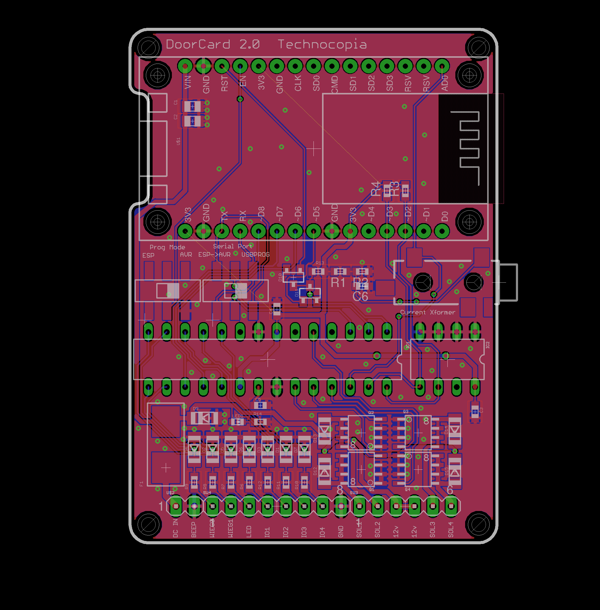

# RFIDDoorEntry
Esp8266/arduino powered keycard access system.

* NodeMCU for internet connectivity.
* Atmega8 to handle reader and door solenoid.
* Shared i2c EEPROM to store card info connected to NodeMCU
* 3mm audio jack for current transformer connected to node and atmega
* 7 GPIO
* 4 MOSFET solenoid drivers

 
 
